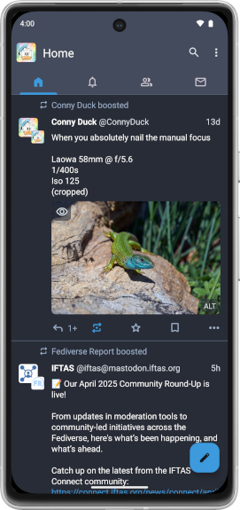

  

    
    <h1> Tusky </h1>
  

  <h2> Mastodon client for Android </h2>

  

    <a href="https://f-droid.org/repository/browse/?fdid=com.keylesspalace.tusky">
      <i class="icon-fdroid-logo"></i> F-Droid</a>
    <a href="https://play.google.com/store/apps/details?id=com.keylesspalace.tusky">
      <i class="icon-google-play"></i> Google Play</a>
  

  

    

      Tusky is a lightweight client for
      <a href="https://joinmastodon.org">Mastodon</a>, a free and open-source social network server. It supports all Mastodon features, like photos, videos,
      lists, custom emojis and is designed according to material guidelines. You can choose between a dark, a light and a black
      theme in Tusky. It has notifications and a drafts feature. Tusky is free and open source software licensed under
      the
      <a href="https://www.gnu.org/licenses/gpl-3.0.en.html">GPL-3.0</a>.
    

    

      If you have any questions, feature requests or you found a bug in Tusky feel free to open
      <a href="https://github.com/tuskyapp/Tusky/issues">an issue on GitHub</a> or send a message to
      <a href="https://mastodon.social/@Tusky" rel="me">@Tusky@mastodon.social</a>.  
      We have compiled some <a href="/faq/">frequently asked questions</a> as well.
    

  

  

<footer>
  <a href="https://github.com/tuskyapp/Tusky/releases/download/v24.1/tusky-v24.1.apk">
    <i class="icon-download"></i>
    Download apk v24.1
  </a>
  <a href="https://github.com/tuskyapp/Tusky/blob/develop/CHANGELOG.md">
    <i class="icon-changelog"></i>
    Changelog
  </a>
  <a href="https://github.com/tuskyapp/Tusky">
    <i class="icon-github"></i>
    GitHub
  </a>
  <a href="https://opencollective.com/tusky">
    <i class="icon-opencollective"></i>
    Support on Open Collective
  </a>
  <a href="/privacy-policy/">
    <i class="icon-changelog"></i>
    Privacy Policy
  </a>
  

    <h3>Tusky is sponsored by</h3>
    
  

</footer>
