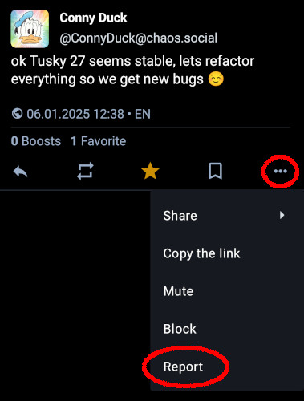

<main>

  <h1>Tusky Safety Standards</h1>

  
Tusky is a client for Mastodon, using the Mastodon API. It acts solely as a frontend to view and post content hosted on Mastodon servers, none of which are provided by the Tusky project.

  
Each Mastodon server has its own moderation rules and team. To report problematic content via Tusky, the app provides a "Report" button for each posting displayed to the user. The "Report" button can be used to contact the moderators of 1) the user's home instance and 2) the instance the problematic posting was provided from, to request action by the moderator teams.

  

      
  

  
If you have any questions about Tusky or this document, you can send a message to
    <a href="https://mastodon.social/@Tusky" rel="me">@Tusky@mastodon.social</a>
    or <a href="mailto:contact@tusky.app">contact@tusky.app</a>

  
<a href="/">Homepage</a>

</main>
